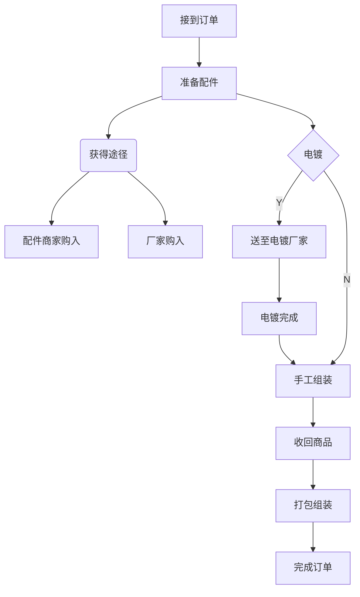

```mermaid
flowchart TD
    A[接到订单] --> B[准备配件]
    B --> J(获得途径)
    J --> C[配件商家购入]
    J -->     D[厂家购入]
    B --> E{电镀}
    E --> |Y|K[送至电镀厂家]
    K --> L[电镀完成]
    L --> F[手工组装]
    E --> |N|F[手工组装]
    F --> G[收回商品]
    G --> H[打包组装]
    H --> I[完成订单]
    
    
    
```