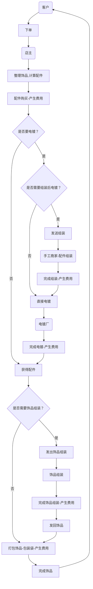

```mermaid
flowchart TD
    A(客户) --> B[下单]
    B --> C(店主)
    C --> D[整理饰品,计算配件]
    D --> F[配件购买-产生费用]
    F --> J{是否要电镀？}
    J --> |是|K{是否需要组装后电镀？}
    J --> |否|E[获得配件]
    K --> |否|G[直接电镀]
    K --> |是|L[发送组装]
    L --> M1(手工商家-配件组装)
    M1 --> N[完成组装-产生费用]
    N --> G
    G --> H(电镀厂)
    H --> I[完成电镀-产生费用]
    I --> E
    E --> O{是否需要饰品组装？}
    O --> |否|P[打包饰品-包装袋-产生费用]
    P --> Q[完成饰品]
    O --> |是|R[发出饰品组装]
    R --> M2[饰品组装]
    M2 --> S[完成饰品组装-产生费用]
    S --> T[发回饰品]
    T --> P
    Q --> A
```
